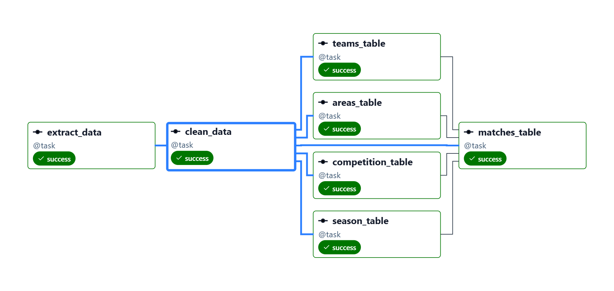

# Football Data Pipeline — de ETL manual a Airflow

Pipeline de datos que extrae partidos de fútbol en directo desde [football-data.org](https://www.football-data.org/), los transforma y los carga en PostgreSQL. El proyecto documenta dos etapas deliberadas: un ETL manual inicial, y su evolución a un DAG orquestado con Apache Airflow 3, corriendo en Docker sobre una Raspberry Pi 4B (8GB).

## Por qué dos versiones

Este repo conserva ambas etapas a propósito, no solo la final. La versión manual (`etl.py`) resuelve el problema de extraer, transformar y cargar los datos una vez. La versión con Airflow (`dag_football_api.py`) resuelve un problema distinto: **repetir ese proceso de forma fiable, con reintentos, paralelismo y visibilidad del historial de ejecuciones**, sin intervención manual.

| | `etl.py` (v1) | `dag_football_api.py` (v2) |
|---|---|---|
| Ejecución | Manual, una sola vez por invocación | Automática, cada 30 min |
| Credenciales | Variables de entorno (`.env`) | Connections de Airflow (cifradas, gestionadas desde la UI) |
| Comunicación entre pasos | Variables Python en memoria (`dt` compartido) | XCom (persistido en la base de metadatos) |
| Conflictos de datos | `ON CONFLICT DO NOTHING` en todas las tablas | `DO UPDATE SET` en `matches` y `seasons` para reflejar partidos en curso |
| Manejo de errores | `except` que registra y continúa | `except` que relanza (`raise`) para que Airflow marque el fallo y dispare reintentos |
| Orquestación de dependencias | Secuencial, todo en un único bloque | Grafo explícito: 4 tasks en paralelo → 1 task final que espera a las 4 |
| Calidad de datos | Sin validación explícita | Task `clean_data` descarta partidos con equipos, competición o temporada nulos antes de cargar nada |

## Arquitectura (v2 — Airflow)



> Nota: la imagen se generó antes de añadir `clean_data`; el flujo actual es `extract_data → clean_data → [areas_table, competition_table, season_table, teams_table] → matches_table`.

`extract_data` trae el JSON completo de la API. `clean_data` filtra los partidos que llegan con `homeTeam`, `awayTeam`, `competition` o `season` sin definir (caso real: cruces de eliminatoria, como Copa Libertadores, cuyos rivales aún no están decididos). `areas`, `competitions`, `seasons` y `teams` son independientes entre sí y se cargan en paralelo a partir de los datos ya limpios. `matches` referencia a las cuatro mediante `FOREIGN KEY`, así que espera a que todas terminen antes de ejecutarse.

## Stack

- **Apache Airflow 3.3.1** (TaskFlow API), desplegado con Docker Compose y CeleryExecutor
- **PostgreSQL** — una instancia propia para los datos, separada de la Postgres interna de metadatos de Airflow
- **Python** (`requests`, `SQLAlchemy`)
- Raspberry Pi 4B (8GB RAM), Docker, red interna entre contenedores

## Decisiones de diseño

- **XCom en lugar de un archivo intermedio**: el volumen de datos por ejecución (partidos de un día, en las 12 competiciones del plan gratuito de la API) es de unos pocos KB — muy por debajo del límite práctico de XCom con Postgres como backend (~1GB, aunque no es su uso previsto para payloads grandes).
- **Connections de Airflow en vez de `.env`**: tanto el token de la API como las credenciales de Postgres viven cifrados en la base de metadatos de Airflow, gestionables desde la interfaz web, en lugar de un archivo de texto plano en disco.
- **`DO UPDATE` solo donde los datos cambian de verdad**: `areas`, `competitions` y `teams` son prácticamente estáticos, así que mantienen `DO NOTHING`. `matches` (estado, marcador) y el `currentMatchday` de `seasons` sí cambian con el tiempo, así que se actualizan explícitamente en cada ejecución sin tocar las columnas de relación (para no romper la integridad de las FK).
- **Frecuencia de 30 minutos**: se comprobó empíricamente el campo `lastUpdated` que devuelve la API para estimar su frecuencia real de refresco, y se contrastó contra el límite de 10 peticiones/minuto del plan gratuito (el DAG hace una única llamada a la API por ejecución completa, independientemente de que después haya 6 tasks en total).
- **`raise` explícito en el manejo de errores**: sin relanzar la excepción capturada, Airflow no puede distinguir una inserción fallida de una exitosa, lo que desactivaría silenciosamente tanto los reintentos como cualquier alerta futura.
- **`clean_data` como task separada de `extract_data`**: se detectó en producción (`NotNullViolation` en `teams`) que la API devuelve partidos de eliminatorias con equipos aún no definidos (`homeTeam.id: null`). Se optó por descartarlos por completo en lugar de insertarlos con valores nulos: como nunca llegan a existir en la tabla, cuando la API asigne los equipos reales en una ejecución futura, el `INSERT` los cargará sin que ningún `ON CONFLICT` los bloquee.

## Configuración necesaria para levantar el proyecto

1. **Connection `token`** (tipo *HTTP* o genérica) en Airflow, con:
   - Host: `https://api.football-data.org/v4/matches`
   - Extra (JSON): `{"X-Auth-Token": "<tu_token_de_football-data.org>"}`
2. **Connection `Football_api`** (tipo *Postgres*), apuntando al contenedor de tu base de datos, con host, puerto, usuario, contraseña y nombre de base de datos reales.
3. El contenedor de Postgres debe estar en la misma red Docker que los contenedores de Airflow (`docker network connect <red> <contenedor_postgres>` si no comparten `docker-compose.yaml`).
4. Las tablas (`areas`, `competitions`, `seasons`, `teams`, `matches`) deben existir de antemano — el `CREATE TABLE IF NOT EXISTS` se ejecuta una vez desde `etl.py` en el despliegue inicial, no forma parte del DAG recurrente.

## Estructura del repo

```
├── etl.py                  # v1: ETL manual (extracción, creación de tablas, carga)
├── dag_football_api.py     # v2: DAG de Airflow (TaskFlow API)
└── README.md
```

## Problemas conocidos

- Se observó puntualmente un valor de `status` con formato de fecha (`"2026-09-07 22:00:00Z"`) en lugar de un estado esperado (`SCHEDULED`, `FINISHED`, etc.) en un partido concreto de la API. Por ahora se considera una anomalía aislada de la fuente; pendiente de vigilar si se repite, y de decidir si `clean_data` debería validar también este campo.

## Próximos pasos

- Reflejar la conexión de red entre Postgres y Airflow directamente en el `docker-compose.yaml`, en vez de la conexión manual actual.
- Configurar alertas (`on_failure_callback`) ahora que las excepciones se propagan correctamente.
- Ampliar el `DO UPDATE` de `seasons` si se detectan más campos que cambian con el avance de la temporada.
